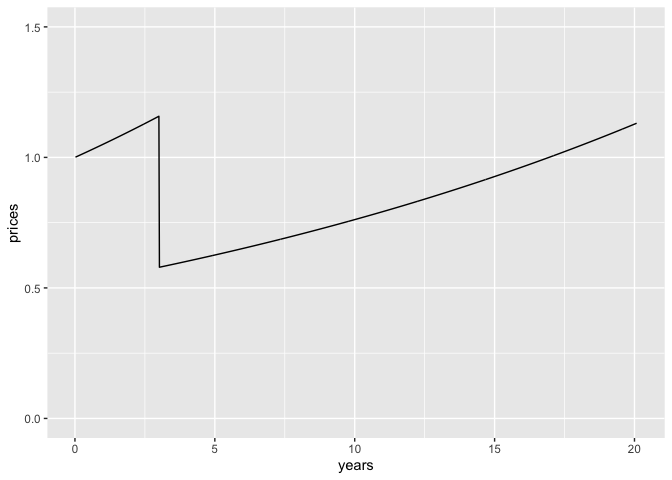

<!-- README.md is generated from README.Rmd. Please edit that file -->

# dynacem: Evaluate present values and cost-effectiveness with dynamic pricing and uptake 

<!-- badges: start -->

[](https://lifecycle.r-lib.org/articles/stages.html#experimental)
[](https://github.com/MSDLLCpapers/dynacem/actions/workflows/R-CMD-check.yaml)
[](https://app.codecov.io/gh/MSDLLCpapers/dynacem)
<!-- badges: end -->

The goal of *dynacem* is to evaluate present values and
cost-effectiveness with dynamic pricing and uptake.

Through the *dynpv()* function, the package provides for the present
value of costs, life years, QALYs or other payoffs in the
cost-effectiveness model to be recalculated so as to allow for dynamic
uptake (also known as multiple cohorts) and dynamic (also known as
life-cycle) pricing. The starting point is a conventional cohort
cost-effectiveness model, such as one computed using the
[heemod](https://cran.r-project.org/package=heemod) package.

## Installation

You can install the development version of dynacem from
[GitHub](https://github.com/) with:

``` r
install.packages("pak")
pak::pak("MSDLLCpapers/dynacem")
```

## Example

Some example present value calculations are provided below for a single
payoff. A typical cost-effectiveness model may involve several separate
payoffs, for each intevention modeled, each with their own price index
and discount rate.

### Obtain payoffs vector

In this case, we call out the drug acquisition cost of the new
intervention (*cost_daq_new*), the total cost (*cost_total*) and QALYs
(*qaly*) accumulated in each timestep. The *get_dynfields()* function
will also calculated ‘rolled-up’ values as at the start of each timestep
rather than discounted to time zero.

``` r
# Load the dynacem package
library(dynacem)
library(ggplot2)
library(tidyr)

# Review oncpsm model (heemod object)
oncpsm
#> 2 strategies run for 1044 cycles.
#> 
#> Initial state counts:
#> 
#> PF = 1
#> PD = 0
#> Death = 0
#> 
#> Counting method: 'life-table'.
#> 
#> Values:
#> 
#>     cost_daq_soc cost_daq_new cost_dadmin cost_dman   cost_ae cost_subs
#> soc     19455.25          0.0    2431.906  4601.624  8000.267  42634.43
#> new         0.00     141997.2    7099.860  8666.132 19999.582  16394.22
#>     cost_total   pf_year life_year     qaly
#> soc   77123.47 0.9582797  1.639185 1.154261
#> new  194156.99 1.9164555  2.963770 2.079786
#> 
#> Efficiency frontier:
#> 
#> soc -> new
#> 
#> Differences:
#> 
#>     Cost Diff. Effect Diff.   ICER Ref.
#> new   117033.5    0.9255249 126451  soc

# Derive the dataset necessary for the dynamic pricing/uptake calculations
democe <- get_dynfields(
    heemodel = oncpsm,
    payoffs = c("cost_daq_new", "cost_total", "qaly"),
    discount = "disc"
    )
head(democe)
#> # A tibble: 6 × 9
#>   model_time cost_daq_new cost_total   qaly int      vt cost_daq_new_rup
#>        <int>        <dbl>      <dbl>  <dbl> <chr> <dbl>            <dbl>
#> 1          1            0       695. 0.0153 soc   1                    0
#> 2          2            0       705. 0.0152 soc   0.999                0
#> 3          3            0       714. 0.0151 soc   0.999                0
#> 4          4            0       721. 0.0150 soc   0.998                0
#> 5          5            0       726. 0.0149 soc   0.998                0
#> 6          6            0       730. 0.0148 soc   0.997                0
#> # ℹ 2 more variables: cost_total_rup <dbl>, qaly_rup <dbl>
```

For this example, we are just interested in the payoff for drug
acquisition costs of the new intervention.

``` r
# Obtain a vector of payoffs
payoffs <- democe |>
    dplyr::filter(int=="new") |>
    dplyr::select(model_time, int, cost_daq_new, cost_daq_new_rup)
payoffs
#> # A tibble: 1,044 × 4
#>    model_time int   cost_daq_new cost_daq_new_rup
#>         <int> <chr>        <dbl>            <dbl>
#>  1          1 new          1493.            1493.
#>  2          2 new          1477.            1478.
#>  3          3 new          1461.            1463.
#>  4          4 new          1446.            1448.
#>  5          5 new          1431.            1434.
#>  6          6 new          1416.            1420.
#>  7          7 new          1401.            1406.
#>  8          8 new          1386.            1392.
#>  9          9 new          1372.            1378.
#> 10         10 new          1357.            1364.
#> # ℹ 1,034 more rows
```

### Define dynamic pricing and uptake

Now let us calculate a discounted present value, given dynamic uptake of
one patient per timestep, and dynamic pricing.

- We assume that there are 52 timesteps per year and a discount rate of
  3% (real) per year.
- The general rate of inflation is 5% per year.
- The underlying price of the payoff being costed rises with inflation
  of 5% for the first three years, then drops by 50%, after which it
  rises by 4% per year.

We create a price index twice as long as we need right now for reasons
that should become clear later.

``` r
# Time horizon
Nt <- nrow(payoffs)

# Nominal discount rate
disc_py <- 0.03 + 0.05
disc_pt <- (1+disc_py)^(1/52) - 1

# Price index
prices <- c(1.05^((1:156)/52), 0.5 * (1.05^3) * 1.04^((1:(2 * Nt-156))/52))

# Graphically check the prices index
tibble::tibble(
  years = (1:Nt)/52,
  prices = prices[1:Nt]
  ) |>
  ggplot2::ggplot(aes(x = years, y = prices)) +
    ggplot2::geom_line() +
    ylim(0, 1.5)
```



### Calculate current present value

Now with the payoff, uptake, pricing and discount rate set, we can call
the *dynpv()* function and calculate the present value of the payoff.

``` r
# Calculate total discounted present value of drug acquisition costs, given dynamic uptake and pricing
pv1 <- dynpv(
    uptakes = rep(1, Nt),
    payoffs = payoffs$cost_daq_new_rup,
    prices = prices[1:Nt],
    disc = disc_pt
    )
pv1$results
#> $ncoh
#> [1] 1044
#> 
#> $uptake
#> [1] 1044
#> 
#> $calc
#> # A tibble: 545,490 × 9
#>        j     k     l     t    uj    pk     R     v    pv
#>    <int> <int> <dbl> <dbl> <dbl> <dbl> <dbl> <dbl> <dbl>
#>  1     1     1     0     1     1 1493.  1.00 1     1494.
#>  2     1     2     0     2     1 1478.  1.00 0.999 1478.
#>  3     1     3     0     3     1 1463.  1.00 0.997 1463.
#>  4     1     4     0     4     1 1448.  1.00 0.996 1447.
#>  5     1     5     0     5     1 1434.  1.00 0.994 1432.
#>  6     1     6     0     6     1 1420.  1.01 0.993 1417.
#>  7     1     7     0     7     1 1406.  1.01 0.991 1402.
#>  8     1     8     0     8     1 1392.  1.01 0.990 1388.
#>  9     1     9     0     9     1 1378.  1.01 0.988 1373.
#> 10     1    10     0    10     1 1364.  1.01 0.987 1359.
#> # ℹ 545,480 more rows
#> 
#> $cohpv
#> # A tibble: 1,044 × 3
#>        j tzero     spv
#>    <int> <dbl>   <dbl>
#>  1     1     0 128471.
#>  2     2     0 128253.
#>  3     3     0 128034.
#>  4     4     0 127813.
#>  5     5     0 127592.
#>  6     6     0 127368.
#>  7     7     0 127143.
#>  8     8     0 126917.
#>  9     9     0 126689.
#> 10    10     0 126460.
#> # ℹ 1,034 more rows
#> 
#> $total
#> [1] 54847752
#> 
#> $mean
#> [1] 52536.16
```

### Present values into the future

We also wish to calculate discounted present values (PV) into the
future, say every annually for 10 years.

We need a price index that lasts 30 years (20 year time horizon + up to
10 years of future evaluations). Fortunately our price index is 40 years
long (2 x 20).

We would expect the PV to change over time. The nominal PV will increase
over time due to price inflation of of this payoff of 4% per year. The
real PV will decrease because the rate of price inflation of this
particular payoff (4% per year) is less than the general rate of
inflation (5% per year) factored into the nominal discount rate (8% per
year).

``` r
# Present value at time 1, 53, 105, ...
pv2 <- futurepv(
  tzero = 1 + (0:10)*52,
  payoffs = payoffs$cost_daq_new_rup,
  prices = prices,
  disc = disc_pt
)

# Obtain a dataset of the real and nominal present value over time
ds <- pv2$results$mean |>
  dplyr::rename(Nominal = mean) |>
  dplyr::mutate(
    Years = tzero/52,
    pinfl = 1.05^Years,
    Real = Nominal / pinfl
    ) |>
  tidyr::pivot_longer(
    cols = c("Nominal", "Real"),
    names_to = "Type",
    values_to = "PV"
  )

# Plot real and nominal present value over time
ggplot2::ggplot(ds,
  aes(x = Years, y = PV, color=Type)) +
  ggplot2::geom_line() +
  xlim(0, 10) +
  ylim(0, 150000)
#> Warning: Removed 2 rows containing missing values or values outside the scale range
#> (`geom_line()`).
```


